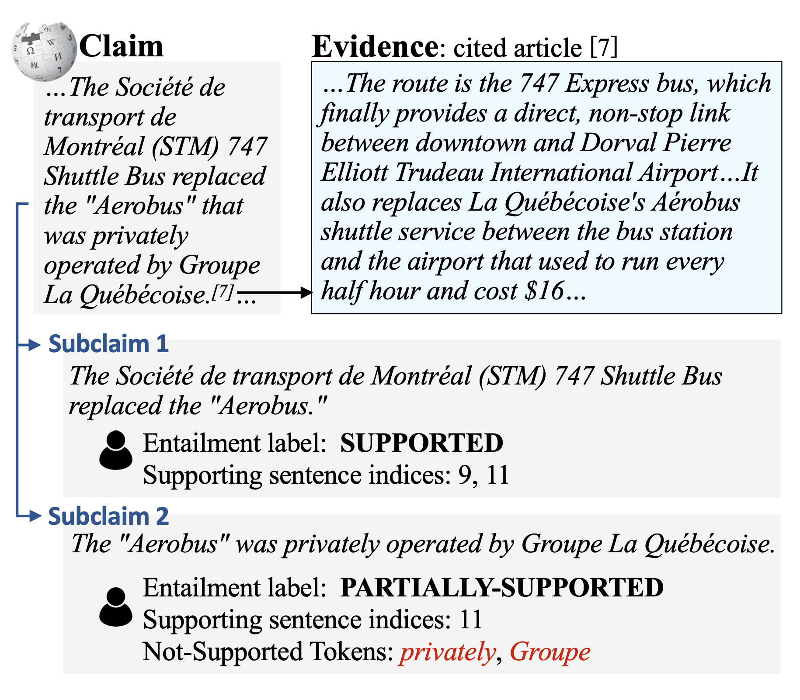
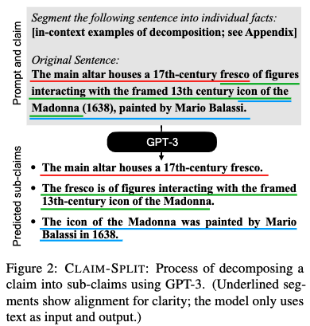

# WiCE: Real-World Entailment for Claims in Wikipedia

This repository contains dataset and code for the paper [WiCE: Real-World Entailment for Claims in Wikipedia](https://arxiv.org/abs/2303.01432) (EMNLP 2023).

Authors: Ryo Kamoi, Tanya Goyal, Juan Diego Rodriguez, Greg Durrett

```bibtex
@inproceedings{kamoi-etal-2023-wice,
    title = "{W}i{CE}: Real-World Entailment for Claims in {W}ikipedia",
    author = "Kamoi, Ryo  and
      Goyal, Tanya  and
      Rodriguez, Juan  and
      Durrett, Greg",
    editor = "Bouamor, Houda  and
      Pino, Juan  and
      Bali, Kalika",
    booktitle = "Proceedings of the 2023 Conference on Empirical Methods in Natural Language Processing",
    month = dec,
    year = "2023",
    address = "Singapore",
    publisher = "Association for Computational Linguistics",
    url = "https://aclanthology.org/2023.emnlp-main.470",
    pages = "7561--7583",
}
```

* The [data](data) directory includes the WiCE dataset.
* The [code_and_resources](code_and_resources) directory includes code and model outputs of the experiments in the paper. Please refer to [code_and_resources/README.md](code_and_resources/README.md) for details.

## Table of Contents

* [WiCE Dataset](#wice-dataset)
  * [Entailment and Retrieval](#entailment-and-retrieval)
  * [Non-Supported Tokens](#non-supported-tokens)
* [Claim-Split](#claim-split)
* [How to Evaluate Your Models on WiCE?](#how-to-evaluate-your-models-on-wice)
  * [Oracle Retrieval Dataset](#oracle-retrieval-dataset)
* [License](#license)

## WiCE Dataset

WiCE is a fine-grained textual entailment dataset built on natural claim and evidence pairs extracted from Wikipedia. Given a sentence in Wikipedia and the corresponding article(s) it cites, we annotate the entailment label, a list of sentences in the cited article(s) that support the claim sentence, and tokens in the claim that are unsupported by the article(s).

This dataset can be used to evaluate a variety of tasks, but is primarily designed for three tasks: entailment classification, evidence sentence retrieval, and non-supported tokens detection.



### Entailment and Retrieval

[data/entailment_retrieval](data/entailment_retrieval) includes the WiCE dataset for entailment and retrieval task. [data/entailment_retrieval/claim](data/entailment_retrieval/claim) includes data with the original claims and [data/entailment_retrieval/subclaim](data/entailment_retrieval/subclaim) includes data with the decomposed claims (finegrained annotation by using Claim-Split).

Each sub-directory includes jsonl files for train, dev, and test sets. Here is an example of the data in the jsonl files:

```json
{
    "label": "partially_supported",
    "supporting_sentences": [[5, 15], [15, 17]],
    "claim": "Arnold is currently the publisher and editorial director of Media Play News, one of five Hollywood trades and the only one dedicated to the home entertainment sector.",
    "evidence": [list of evidence sentences],
    "meta": {"id": "dev02986", "claim_title": "Roger Hedgecock", "claim_section": "Other endeavors.", "claim_context": [paragraph]}
}
```

* `label`: Entailment label in {`supported`, `partially_supported`, `not_supported`}
* `supporting_sentences`: List of indices of supporting sentences. All provided sets of supporting sentences are valid (in the above example, both `[5, 15]` and `[5, 17]` are annotated as correct sets of supporting sentences that include same information).
* `claim`: A sentence from Wikipedia
* `evidence`: A list of sentences in the cited website
* `meta`
  * `claim_title`: Title of the Wikipedia page that includes `claim`
  * `claim_section`: Section that includes `claim`
  * `claim_context`: Sentences just before `claim`

### Non-Supported Tokens

[data/non_supported_tokens](data/non_supported_tokens) includes the WiCE dataset for non-supported tokens detection task. We only provide annotation for sub-claims that are annotated as `partially_supported`. We filtered out data points with low inter-annotator agreement (please refer to the paper for details).

```json
{
    "claim": "Irene Hervey appeared in over fifty films and numerous television series.",
    "claim_tokens": ["Irene", "Hervey", "appeared", "in", "over", "fifty", "films", "and", "numerous", "television", "series", "."],
    "non_supported_spans": [false, false, false, false, true, true, false, false, false, false, false, false],
    "evidence": [list of evidence sentences],
    "meta": {"id": "test00561-1", "claim_title": "Irene Hervey", "claim_section": "Abstract.", "claim_context": " Irene Hervey was an American film, stage, and television actress."}
}
```

* `claim_tokens`: List of tokens in the claim
* `non_supported_spans`: List of bool corresponding to `claim_tokens` (`true` is non-supported tokens)

## Claim-Split

[claim_split](claim_split) directory includes prompts for Claim-Split, a method to decompose claims by using GPT-3. We use different prompts for different datasets in the experiments in this work, so we provide prompts for WiCE, VitaminC, PAWS, and FRANK (XSum).



## How to Evaluate Your Models on WiCE?

When you evaluate entailment classification models on WiCE, unless your model can handle with very long input context, you have to retrieve evidence sentences from evidence articles as the first step. Please refer to our paper for possible approaches for evaluating models with limited input length on WiCE.

If you evaluate evidence retrieval models, you can use the data in [data/entailment_retrieval](data/entailment_retrieval).

### Oracle Retrieval Dataset

If you are looking for simple NLI datasets with short evidence that do not require any retrieval models (like SNLI, MNLI, and ANLI), you can use our [oracle retrieval dataset](code_and_resources/entailment_inputs/oracle_chunks/). The oracle retrieval dataset simulates the situation that you have a perfect evidence retrieval model. When you report the result on this oracle retrieval data, you need to clearly mention that you use the oracle retrieval dataset, not the original WiCE dataset.

We provide code for reproducing our experiment using GPT-3.5 and GPT-4 on the oracle retrieval dataset. Please refer to [code_and_resources/code/README.md](code_and_resources/code/README.md) for details.

## License

Please refer to the [LICENCE.md](./LICENSE.md) file.
